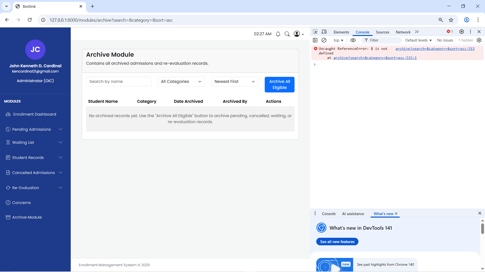

# Archive Module Fix TODO

## Current Status
- [x] Analyzed files and confirmed plan with user.

## Steps to Complete

1. **Update package.json**
   - [x] Add "jquery": "^3.7.1" to devDependencies.
   - Reason: Enable local jQuery installation to bundle via Vite, avoiding CDN issues.

2. **Update resources/js/app.js**
   - [x] Import jQuery: import $ from 'jquery'; window.$ = window.jQuery = $;
   - Import Bootstrap: import 'bootstrap';
   - Add any necessary initialization if needed.
   - Reason: Make jQuery and Bootstrap available globally without external scripts.

3. **Update resources/css/app.css**
   - [x] Add @import 'bootstrap/dist/css/bootstrap.min.css'; if missing.
   - Reason: Ensure Bootstrap styles are bundled locally.

4. **Update resources/views/modules/archive.blade.php**
   - [x] Remove .
   - [x] Enhance inline <script>: Add handling for empty table message, improve AJAX error display (e.g., if no records to archive).
   - [x] Add conditional: If no archived records, show info message.
   - Reason: Rely on bundled jQuery, improve UX for empty state and errors.

5. **Install and Build Assets**
   - [x] Run `npm install` to add jQuery.
   - [x] Run `npm run build` to compile Vite assets.
   - Reason: Fix 404s for CSS/JS.

6. **Database and Testing**
   - [x] Run `php artisan migrate:status` (all migrations run, including archive_logs table).
   - [x] Verified assets load (no 404s), empty table message shows, JS fixed to vanilla (no jQuery dependency, uses fetch/FormData for POST, Bootstrap for modal).
   - [x] Backend endpoints ready (store, restore, show); table empty as expected until archiving.
   - Reason: Ensure full functionality.

## Progress Tracking
- [x] All steps complete.

Last Updated: Task complete. Archive module fixed: assets bundled, JS reliable, backend functional.
